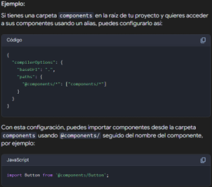
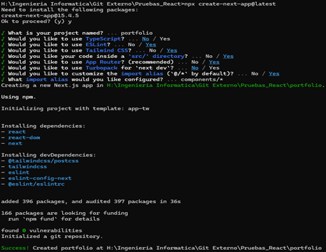
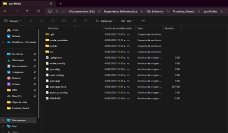

# 🚀 ¿Cómo crear una app de React con Next.JS?

Este documento explica paso a paso cómo crear una aplicación utilizando **React con Next.JS**, usando  **JavaScript**.

---

## ✅ Requisitos previos

- Tener instalado **Node.js**  
  👉 Recomendado: última versión estable desde [nodejs.org](https://nodejs.org/)

---

## 🎯 Creación de la app

👉 Documentación del Framework: última versión estable desde [nextjs.org](https://nextjs.org/docs/app/getting-started/installation)

```bash
npx create-next-app@latest
```

- Primero escogemos el nombre del proyecto.
- Escogemos si deseamos usar Ts o Js.
- Para escoger entre ESLint, lo vamos a definir: ESLint es un proyecto de código abierto que lo ayuda a encontrar y solucionar problemas con su código JavaScript. No importa si está escribiendo JavaScript en el navegador o en el servidor, con o sin framework, ESLint puede ayudar su código viva su mejor vida.
- Para escoger Tailwind CSS, lo vamos a definir: Tailwind CSS es un framework CSS "utility-first" que permite a los desarrolladores construir interfaces de usuario personalizadas directamente en el HTML, utilizando clases predefinidas para estilos. (Ejm: text-center, p-4, bg-blue-500).
- Escogemos que la app se cree dentro del directorio src.
- Escogemos el proyecto tenga el enrutamiento que incluye el framework. 
- Para escoger Turbopack, lo vamos a definir: Turbopack es un empaquetador incremental, desarrollado por Vercel y escrito en Rust, que está integrado en Next.js para mejorar la velocidad de desarrollo y las compilaciones locales, especialmente para aplicaciones grandes. Es un sucesor espiritual de Webpack y se enfoca en ser más rápido en el modo de desarrollo, ofreciendo inicios de servidor más rápidos y actualizaciones de código más rápidas con Fast Refresh. 
- En Next.js, un alias de importación permite crear atajos para rutas de importación, haciendo que el código sea más limpio y fácil de mantener, especialmente en proyectos grandes. En lugar de usar rutas relativas largas y complejas, puedes definir alias que apuntan a carpetas o archivos específicos dentro de tu proyecto. 



### Lo que vemos en el terminal



---

## 📁 Estructura y ejecución del proyecto

Una vez creada la app, debes dirigirte a la carpeta generada (portfolio, en este caso):

```bash
cd portfolio
```



### ▶️ Para ejecutar la app:

Finalmente tenemos el proyecto creado y ejecutamos el comando segun el gestor de paquetes que usemos:

```bash
npm run dev
# or
yarn dev
# or
pnpm dev
# or
bun dev
```

---

## ✍️ Autor

- Creado por Rubén Velasco (Velasco-Dev)
- 📅 Fecha de creación: 04/08/2025

